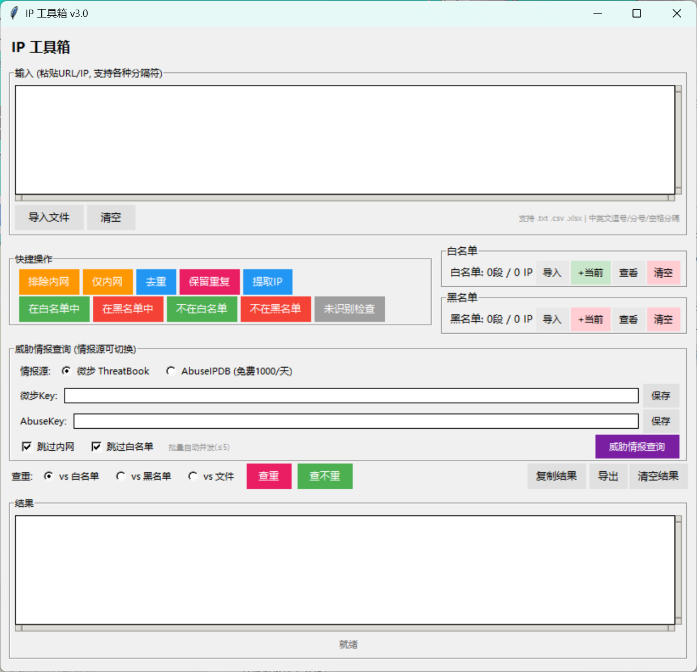

# IP Toolbox · IP 工具箱

> 把「一大坨混着 URL、端口、中文逗号、网段写法五花八门的 IP 清单」，
> 在几秒内洗成干净、可比对、可判定的结果。

单文件、零必需依赖（只用 Python 标准库）、GUI + CLI 双用的 IP 清单处理工具。
面向安全运营 / SRC 众测 / 攻防演练 / 资产盘点场景。

**核心能力**：内网筛选 · 白名单/黑名单匹配 · 网段去重与重叠判定 · 跨文件查重 · 9+ 种网段写法解析（含笔误自动纠正）· 微步 / AbuseIPDB 威胁情报批量判定。



---

## 目录

- [为什么做这个工具](#为什么做这个工具)
- [适用场景](#适用场景)
- [功能一览](#功能一览)
- [快速开始](#快速开始)
- [GUI 界面](#gui-界面)
- [快捷操作](#快捷操作)
- [白名单/黑名单](#白名单黑名单)
- [查重/查不重](#查重查不重)
- [威胁情报查询](#威胁情报查询)
- [CLI 命令行](#cli-命令行)
- [支持的输入格式](#支持的输入格式)
- [支持的范围格式](#支持的范围格式)
- [实战案例](#实战案例)
- [文件拖放](#文件拖放)
- [快捷键](#快捷键)
- [文件结构](#文件结构)
- [依赖](#依赖)
- [安全与合规](#安全与合规)
- [已知限制](#已知限制)
- [常见问题](#常见问题)
- [License](#license)

---

## 为什么做这个工具

做资产测绘和漏洞批量提交时，手上的清单从来不会很干净：

```
hunter 导出：http_urls 列，混着 http:// IP:端口，几千行带重复
公司给的内网/出口 IP 表：10.10.83/84/85.0、10.9.0.*-10.9.22.*、10.230.9.0.24（笔误）
红牛/防守方名单：一段 CIDR，还夹着中文逗号
告警日志：一整行里只有中间那个 IP 有用
```

这类活每次都要现写一段 `awk`/临时脚本，写完用完就丢，第二天换个格式又得重写。
所以把它固化成了一个单文件工具：**输入格式再乱也不用管，先粘进来，点按钮出结果**。

它解决的三类麻烦：

1. **格式脏** —— URL、IP:端口、域名混排，中文逗号/顿号/竖线分隔，编码 UTF-8 或 GBK，全部自动识别。
2. **写法杂** —— 9 种以上网段表达法（末段范围、通配符、枚举段、掩码写法…）都能解析成可比较的网段对象，
   连 `10.230.9.0.24` 这种笔误都能纠正；同时**严格按你写下的字面量展开**，
   `10.10.83/84/85.0` 就是 3 个 IP，不会自作主张扩成 3 个 C 段（见[支持的范围格式](#支持的范围格式)）。
3. **判断慢** —— 「这批 IP 哪些是内网、哪些在授权范围内、哪些和上批重复、哪些是恶意」，四个高频问题各自一个按钮。

> 8 个可以直接复制粘贴复现的案例集中在文末 [实战案例](#实战案例)（示例用公共 DNS 与明显是样例的公网 IP，
> 不含真实资产；注意 RFC 5737 文档段会被判为内网，所以「排除内网」类示例特意用了
> `114.114.x` / `223.5.5.x` / `47.98.x`，见 [已知限制](#已知限制)）。

## 适用场景

| 场景 | 具体做什么 |
|------|-----------|
| **SRC 众测 / 漏洞提交** | 拿到公司授权 IP 段清单，从测绘结果里筛出「在授权范围内的目标」，剔除内网与范围外资产，避免误打误撞提交了不在 scope 的资产 |
| **红蓝对抗 / 演练准备** | 导入红队资产列表 vs 蓝队白名单，秒级得到命中/未命中两份清单，判断哪些是自家设备、哪些是外部扫描源 |
| **资产测绘结果清洗** | Hunter / 各类测绘导出几十万行 `http_urls`，去内网、去重、提取纯 IP，直接喂给下一个扫描器 |
| **威胁情报批量研判** | 告警日志里几十个可疑 IP 需要定性，勾选跳过内网/白名单后一键批量查微步或 AbuseIPDB，带 `is_malicious` / 置信度分级着色 |
| **扫描器 scope 配置** | 把散乱的 IP 表达统一成最小覆盖网段集合（按网段重叠去重），生成 Masscan / Nmap / Xray 的目标文件 |
| **应急 / 日志排查** | 手上两份清单要交叉比对（新增了哪些、哪些重复、哪些只在 A 里），不必开 Excel 做 VLOOKUP |
| **日常运维打杂** | 只是想把 `1.1.1.1，2.2.2.2;3.3.3.3` 变成干净的每行一个 IP |

**不太适合**：IPv6（当前只做 IPv4）、需要精确 CIDR 路由计算的网络工程场景、要求无人值守定时跑的服务化场景（它是人工触发的处理工具，不是守护进程）。

---

## 功能一览

| 模块 | 能力 |
|------|------|
| 输入解析 | 粘贴 / 导入 / 拖放 `.txt` `.csv` `.xlsx`；自动编码检测（UTF-8 / UTF-8-BOM / GBK / GB2312 / UTF-16）；8 种分隔符混用；URL、`IP:端口`、域名混合行提取 |
| 网段解析 | 单 IP、末段范围、完整 IP 范围、CIDR、CIDR 范围、通配符、单通配符、枚举段、子网掩码，外加中间段范围、笔误/漏点修复、行内注释；**手写多值按字面量展开，绝不自动扩成 C 段** |
| 内网处理 | 排除内网 / 仅保留内网，按工具自带的固定清单识别 RFC1918、回环、链路本地、广播/保留段与文档段；`100.64.0.0/10` 按公网，跨内外边界的写法不算内网（见 [已知限制](#已知限制)） |
| 去重 | 行级去重、重复行提取、**按网段重叠去重**（重叠时保留信息更全的网段） |
| 名单 | 白名单/黑名单独立持久化，导入追加、「+当前」存储前自动去重、弹窗查看编辑（搜索/高亮/增删） |
| 匹配 | 输入 vs 名单的四象限筛选：在/不在白名单、在/不在黑名单，**按原始行输出**不丢 URL；名单并区间后二分，2 万行 × 454 段约 0.15 秒 |
| 数据体检 | 「未识别检查」按行号列出需要人工核对的行并分类给出原因（无法识别 / 非法前缀 / 整行含噪声 / 按字面量收窄 / 同行有写法未进名单 / 范围结尾缩写 / 范围两端写反 / 覆盖过大），对「整行夹着无关文字」的行只输出内嵌 IP、不回显原文，GUI 与 CLI 都不再静默 |
| 跨文件比对 | 两份文件互查共同/独有 IP |
| 威胁情报 | 微步 ThreatBook（批量 100/次）与 AbuseIPDB 双源切换，结果按恶意/可疑/良好着色 |
| 输出 | 结果区直接编辑复制，或导出文件；CLI 支持 `-o` 重定向 |

---

## 快速开始

```bash
git clone https://github.com/sunp-1/ip-toolbox.git
cd ip-toolbox

# 方式一：GUI（零依赖，装了 Python 就能跑）
python ip_tool.py

# Windows 可直接双击 start-gui.bat

# 方式二：CLI —— 排除内网
python ip_tool.py -n input.txt -o public.txt
```

可选依赖（Excel 读取、文件拖放）：

```bash
pip install -r requirements.txt
```

---

## GUI 界面

界面见文首封面图。

| 区域 | 功能 |
|------|------|
| **输入区** | 粘贴 URL/IP/域名，或导入、拖放文件（支持 `.txt` `.csv` `.xlsx`） |
| **快捷操作** | 一键筛选内网、去重分析、提取 IP、名单匹配 |
| **白名单/黑名单** | 导入、存储（自动去重）、查看编辑、清空 |
| **威胁情报查询** | 对接微步 / AbuseIPDB，批量判定 IP 是否恶意 |
| **查重/查不重** | 输入 vs 白名单/黑名单/文件，输出命中或未命中的原始行 |
| **结果区** | 操作结果直接展示，可复制、导出 |

---

## 快捷操作

| 按钮 | 功能 | 输出 |
|------|------|------|
| **排除内网** | 移除内网地址（支持单 IP/范围/CIDR） | 保留公网 IP 和域名 |
| **仅内网** | 只保留内网 IP | 仅内网 IP/范围 |
| **去重** | 按网段重叠去重，重叠时保留信息更全的网段 | 覆盖所有已输入网段的最小集合 |
| **保留重复** | 找出互相重叠的部分（按网段相交判定，不是字符串相等） | 重叠部分的交集网段，如 `10.0.0.0/8` 与 `10.230.9.0/24` → `10.230.9.0/24` |
| **提取 IP** | 解析并展开所有 IP 范围 | CIDR 展开为完整 IP 列表 |
| **在白名单中** | 筛选输入中命中白名单的行 | 命中的原始行 |
| **不在白名单** | 筛选输入中未命中白名单的行 | 未命中的原始行 |
| **在黑名单中** | 筛选输入中命中黑名单的行 | 命中的原始行 |
| **不在黑名单** | 筛选输入中未命中黑名单的行 | 未命中的原始行 |
| **未识别检查** | 列出输入里需要人工核对的行：解析不出的、非法前缀/掩码的、整行含噪声的、按字面量被收窄的、同行有写法没进名单的、范围结尾缩写的、范围两端写反的、掩码小到把地址归零的 | 行号 + IP/截断原文 + 原因，末尾给八类分别计数 |

> **未识别检查**：白名单里写错的行（`256.1.1.1`、`1.1.1.1/33`、`010.1.1.1`、IPv6、串进来的中文标签）以前会被**静默丢弃**，
> 你会以为白名单生效了，实际那一段根本没匹配。现在做名单/内网筛选后，结果区末尾会追加
> `[注意] N 行需人工核对 (无法识别 a、非法前缀 b、整行含噪声 c、按字面量收窄 d、同行有写法未进名单 e、范围结尾缩写 f、范围两端写反 g、覆盖过大 h)…`（只列本次出现过的类别），
> 点「未识别检查」可以看全；CLI 同样的信息打到 stderr，不污染管道输出。
> 其中 `1.1.1.1/33` 这类非法前缀会明确提示「整行未参与匹配」—— 它**不会**被兜底成 `/32`，
> 想放行单个 IP 请把 `/33` 删掉。
>
> 第三类是**脏行**：`, sadhsajgd127.0.0.1`、`v110.1.1.1`，以及整条命令行/日志行里藏着 IP 的写法，例如
> `node "D:\demo\mcp-server.mjs" --port 19016 127.0.0.1`。工具会从行内挖出那个 IP 参与判定，
> 但**结果区只输出 IP，绝不回显原始整行**（`127.0.0.1` 而不是那一整条命令）——
> 结果区是要「复制结果 / 导出」成资产清单的，把本地路径、端口、无关文字抄进去既没用也泄露环境信息。
> 这类行统一在「未识别检查」与 `[注意]` 里点名，写成 `第 N 行  IP 127.0.0.1（整行含无关文字，原文已省略）`，
> 给行号方便回输入框定位，但不抄原文。
> 干净行不受影响：URL、域名、CIDR、`1.1.1.1:80` 仍按**原始行**输出（URL 与域名信息不丢）；
> 分隔符（逗号 / 分号 / 顿号 / 竖线 / 制表符 / 空格 / 换行）会先切词，所以 `10.0.0.1,UP`、`web服务器 10.0.0.1` 里的 IP 也算正常行。
> 空格与制表符只**切词**、不切行，也不会把范围跨空格接起来：`10.0.0.1 255.0.255.0` 是两个各 1 个地址的 `/32`，
> 不是「IP + 掩码」的一个网段（那种非连续掩码 `10.0.0.1/255.0.255.0` 直接 0 个并点名，绝不猜成 `/8`）。
>
> 第四类**按字面量收窄**不是错误：`10.10.83/84/85.0`、`10.230.9.0.24` 这类手写写法照常参与判定，
> 只是工具会告诉你它被算成了 3 个 IP / 1 个 IP，而不是替你扩成一个 C 段。
> 想表达整段就写显式掩码（见 [支持的范围格式](#支持的范围格式)）。
>
> 还有两类同样「不是错误，但一定要看一眼」：**范围结尾缩写**（`192.168.0.1-0.254` 补成 `192.168.0.254`，
> 只有左右同段数字重复时才敢补）、**覆盖过大**（`1.1.1.1/0` 的掩码把你写的地址归零成 `0.0.0.0/0`，
> 一行就是整张 IPv4；`10.1.1.77/16`、`10.0.0.5/255.0.0.0` 这类同样归零，量级小一号也照样点名）。
> 这两类照常参与匹配，提示里会把变成多少个 IP 直接算给你看。
> 反过来，**段值超出 0-255 的行不进名单**：`1.1.1.2024` 不会被截成 `1.1.1.202`，
> `1.1.1.0x1` 也不会被当成 `1.1.1.0` —— 少看一位数字就多出一台谁都没写过的机器，那是认错地址。
> **掩码同理**：`1.1.1.1/1abc` 不会被只取开头的 `1` 当成 `/1`（那是半张互联网），
> `1.1.1.1/-1` 也不会被当成 `/32` 悄悄放行 —— 整行不参与匹配并点名。

> **去重 vs 保留重复**：发 10 个 IP 有重复时，`去重` 给唯一的、重叠时保留更全的网段（如 `0.0.0.0` 与 `0.0.0.0/16` 保留 `/16`）；`保留重复` 给互相配重的那部分（输出交集网段，用来核对「哪几段配重了」）。

> **每个按钮都读输入区**：结果出来后再点别的按钮，处理对象仍是**输入区**那份数据，不是上一次的结果。
> 想接着上一步继续洗，点结果区的「复制结果」→ 粘回输入区（`Ctrl+Enter` 等于点「排除内网」）。

> **注意**：「提取 IP」会将 ≤/24 的网络段展开为完整 IP 列表，大段（>256 IP）保留 CIDR 表示，避免一次性生成超大列表卡住界面。

---

## 白名单/黑名单

数据持久化在脚本同目录的隐藏文件里（已被 `.gitignore` 排除，不会被提交）：

- `.ip_tool_whitelist.txt` — 白名单
- `.ip_tool_blacklist.txt` — 黑名单

| 按钮 | 功能 |
|------|------|
| **导入** | 从文件追加范围到名单（与现有合并） |
| **+当前** | 把输入区内容**先去重**再存进名单，已存在的跳过 |
| **查看** | 弹窗编辑，支持搜索 / 高亮 / 增删 |
| **清空** | 清除所有规则 |

状态栏显示格式：`白名单: 128段 / 9.2万 IP`

> **存储自动去重**：点「+当前」时，输入里重复的 IP（如 `203.0.113.1` 出现 3 次、或 `203.0.113.1` 与 `http://203.0.113.1:8080`）会被合并成一条再存储，名单不会堆积重复。

---

## 查重/查不重

底部查重行，先选对比对象，再点按钮：

```
查重: (o)vs白名单 (o)vs黑名单 (o)vs文件    [查重] [查不重]
```

| 按钮 | 颜色 | 输出 |
|------|------|------|
| **查重** | 红 | 输入里**在名单中**的行（命中白名单/黑名单） |
| **查不重** | 绿 | 输入里**不在名单中**的行（含域名，直接复制） |

**按原始行输出**：粘贴的 URL/域名会原样保留，不丢失。`查重 + 查不重` 行数 = 输入总行数
（例外：整行夹着无关文字的行只输出内嵌 IP，一行可能展开成多行）。

> **提示**：比对按**网段重叠**判定，不是字符串相等：名单里有 `203.0.113.0/24`，输入 `203.0.113.5` 就算命中；
> 反过来 `203.0.113.80` 与 `204.0.113.80` 是两个不同地址，不会误判为重复。
> 名单里解析不出来的行（`256.1.1.1`、IPv6、域名）一律按「未命中」处理，用「未识别检查」把它们揪出来。

---

## 威胁情报查询

对接威胁情报平台，批量判定 IP 是否恶意。**两个情报源可切换：**

### 1. 微步在线 ThreatBook（国内，推荐）

- **注册**：[x.threatbook.com](https://x.threatbook.com) → 账号 → API 管理 获取 API Key
- **接口**：`GET https://api.threatbook.cn/v3/scene/ip_reputation`（IP 信誉，个人可用）
- **批量**：一次最多查询 100 个 IP，超出自动分批
- **判定**：使用权威字段 `is_malicious`，附严重程度 / 可信度 / 威胁类型 / 攻击团伙 / 位置 / ASN
- **⚠️ 注意**：个人账号默认可能未开通该接口权限，需在控制台申请开通

### 2. AbuseIPDB（国外）

- **注册**：[abuseipdb.com](https://www.abuseipdb.com) → API → 创建 key（个人免费额度以官网为准）
- **接口**：`GET https://api.abuseipdb.com/api/v2/check`（Header: `Key`）
- **判定**：基于 `abuseConfidenceScore` 置信度（0-100）分级
- **⚠️ 注意**：需要能访问国外网络；该平台为逐 IP 查询，多 IP 时并发发送请求

### 查询结果展示

```
203.0.113.7   [判定: 恶意]
  是否恶意 : 是      严重程度: 高危      可信度: 高
  威胁类型 : 僵尸网络 / 暴力破解
  攻击团伙 : 示例团伙
  位置     : 示例地区 示例运营商
  ASN     : AS64500 EXAMPLE (风险值9)
  更新时间 : 2026-08-04 06:01:02
  情报页   : https://x.threatbook.com/v5/ip/203.0.113.7
```

判定颜色分级：

- 🔴 **恶意** — 微步 `is_malicious=true` / AbuseIPDB 置信度 ≥50
- 🟠 **可疑** — AbuseIPDB 置信度 1-49 / 微步严重程度含「可疑」
- 🟢 **良好** — 无威胁

**设置步骤**：

1. 选择情报源（微步 / AbuseIPDB）
2. 填入对应 API Key 并点「保存」（写到脚本同目录的本地隐藏文件，重启不丢）
3. 输入区粘贴单个或多个 IP（URL / IP:端口 均可）
4. 勾选「跳过内网」「跳过白名单」省额度
5. 点「威胁情报查询」，结果直接展示在结果区

> 默认勾选跳过内网/白名单，避免浪费免费查询额度。

---

## CLI 命令行

```
python ip_tool.py [input] [options]

参数:
  input                   输入文件 (每行一个 URL 或 IP)

选项:
  -n, --no-internal       排除内网 IP (保留公网)
  --only-internal         仅保留内网 IP
  -r FILE, --range-file   白名单文件 (保留在范围内的)
  --exclude FILE          排除文件 (排除在范围内的, 黑名单)
  --uniq                  文件内去重
  --dedup FILE2           跨文件查重 (对比另一个文件)
  -o FILE, --output FILE  输出文件 (不指定则输出到屏幕)
  -h, --help              帮助

无参数启动 GUI 模式
```

### CLI 示例

```bash
# 从测绘结果中排除内网 IP
python ip_tool.py -n 测绘导出.txt -o public_only.txt

# 用授权 IP 白名单过滤目标（只保留在授权范围内的）
python ip_tool.py -r scope-whitelist.txt targets.txt -o matched.txt

# 黑名单排除（不在黑名单中的保留）
python ip_tool.py --exclude blacklist.txt targets.txt -o clean.txt

# 查重：两个文件中有多少重复 IP
python ip_tool.py --dedup old_batch.txt new_batch.txt

# 去重后输出
python ip_tool.py --uniq input.txt -o output.txt

# 组合：排除内网 + 白名单过滤 + 去重
python ip_tool.py -n -r scope-whitelist.txt --uniq input.txt -o result.txt

# 管道用法：CLI 读文件，结果落盘
python ip_tool.py -n -o clean.txt raw.txt
```

> CLI 里的统计信息打到 stdout，`-o` 只写数据行，因此可以安全地 `python ip_tool.py -n raw.txt > /dev/null` 之后取文件。

**需要人工核对的行会打到 stderr**（stdout 仍可安全重定向）：输入、白名单/黑名单、`--dedup` 对比文件都会检查，
按「无法识别 / 非法前缀 / 整行含噪声 / 按字面量收窄 / 同行有写法未进名单 / 范围结尾缩写 / 范围两端写反 / 覆盖过大」八类分类计数，每行附带原因，最多列 10 行：

```
[警告] 输入 raw.txt: 1 行需人工核对 (整行含噪声 1):
    第 3 行    IP 127.0.0.1（整行含无关文字，原文已省略）    # 整行含文字，已按内嵌 IP 127.0.0.1 识别，请确认没挖错
  其中 1 行整行夹着无关文字, 结果里只输出挖出的内嵌 IP, 原始行不会写进输出
[警告] 白名单 scope-whitelist.txt: 4 行需人工核对 (无法识别 2、非法前缀 1、按字面量收窄 1):
    第 2 行    256.1.1.1    # 第 1 段 256 超出 0-255, 整行未参与匹配; IP 段只能是 0-255, 请检查笔误
    第 3 行    1.1.1.2024    # 第 4 段 2024 超出 0-255, 整行未参与匹配; 工具不会把 2024 截成 202 当成一个合法 IP, 请检查笔误
    第 4 行    1.1.1.1/33    # CIDR 前缀 /33 非法(>32), 整行未参与匹配; 要放行单个 IP 请把 /33 删掉
    第 5 行    10.10.83/84/85.0    # 手写范围按字面量识别为 3 个 IP (10.10.83.0、10.10.84.0、10.10.85.0), 未自动扩成整段; 要整段请写显式掩码, 如 10.10.83/84/85.0/24
白名单过滤: 保留 1, 移除 1
```

前两类（无法识别 / 非法前缀）说明你以为放行的段实际没按预期生效 —— 以前它们是彻底静默的。
`1.1.1.2024` 这类「多打一位数字」的行尤其要看清：工具不会把它截成 `1.1.1.202` 蒙过去。
第三类「按字面量收窄」不是错误：那一行照常参与匹配，只是工具会告诉你它被算成了几个 IP。

---

## 实战案例

下面 8 个案例都可以直接复制粘贴复现（示例用公共 DNS 与明显是样例的公网 IP，不含真实资产；
注意 RFC 5737 文档段会被判为内网，所以「排除内网」类示例特意用了 `114.114.x` / `223.5.5.x` / `47.98.x`，见 [已知限制](#已知限制)）。

### 案例 1｜测绘导出结果，清洗到能直接喂给扫描器

**痛点**：Hunter / 测绘平台导出的 `http_urls`，URL、端口、中文逗号、内网段混在一起，
`awk` 切完还得手工删内网。

粘进输入区：

```
http://114.114.114.5:8080/login
10.10.83/84/85.0
114.114.114.1，223.5.5.7
114.114.200.129-254
10.230.9.0.24
www.example.com
47.98.100.23
```

点「排除内网」→ 结果区 **6 行 / 130 个IP，移除 2**：内网的 `10.10.83/84/85.0`（3 个 IP）
与笔误行 `10.230.9.0.24` 被剔除，中文逗号那行拆成两个公网 IP，URL 与域名行原样保留不丢。
末尾还会追加 `[注意] 2 行需人工核对 (按字面量收窄 2)`：这两行照常参与判定，
但工具会告诉你它们各自被理解成了什么（见下一个案例）。要接着去重就点「复制结果」再粘回输入区点「去重」。

### 案例 2｜提交前确认目标在不在授权 scope

**痛点**：公司给的授权表写法五花八门（`10.9.0.*-10.9.22.*`、`114.114.114.0/24`、
`114.114.200.129-254`），拿它跟测绘结果比对时，只要有一条不在 scope 就是无效提交甚至越界。

先把授权段粘进输入区 → 点白名单的「+当前」存成名单（自动去重合并）：

```
114.114.114.0/24
223.5.5.0/24
10.0.0.0/8
114.114.200.129-254
```

再把上面那 7 行脏数据粘回输入区，点「在白名单中」/「不在白名单」：

- **在白名单**：**6 行 / 133 个IP** —— URL 行、枚举段、范围行、笔误段全部命中；
- **不在白名单**：只剩 `www.example.com` 和 `47.98.100.23`，直接从提交清单里删掉。


判定按**网段重叠**而不是单 IP 相等：`114.114.200.129-254` 这种范围行、
`10.10.83/84/85.0` 这种枚举段都会正确参与匹配（早期版本会漏）。

> **手写写法按字面量算，绝不替你放大**。同一批数据在旧版本里：
>
> | 你写的 | 现在的理解 | v3.0 初版（已废弃） |
> |--------|-----------|-------------------|
> | `10.10.83/84/85.0` | 3 个 IP | 3 个 /24 = 768 个 IP |
> | `10.1-5.0.0` | 5 个 IP | 5 个 /16 = 32.7 万个 IP |
> | `198.51.100.0-198.51.110.0` | 2561 个 IP（含两端） | 2816 个 IP（两端各补成 /24，越界 255 个） |
> | `10.230.9.0.24` | 单个 IP `10.230.9.24` | `10.230.9.0/24` = 256 个 IP |
>
> 做 scope 判定时「多算」等于「越界」，所以宁可少算并明确告诉你算成了什么。
> 要整段就写显式掩码：`10.10.83/84/85.0/24` → 3 个 /24，`10.1-5.0.0/16` → 5 个 /16，
> `10.10.83.*` 或 `10.10.83.0/24` → 一个 C 段。

### 案例 3｜白名单写错了，工具当场指出来

**痛点**：名单里一行 `1.1.1.1/33`（想写 `1.1.1.0/24`）、一行 `256.1.1.1`（多打了一位）、
混进来的 IPv6 —— 这些行过去会被**静默丢弃**，你以为放行生效了，实际那段根本没匹配。

粘进输入区后点「未识别检查」，按行号列出每一行的问题（结果：**需检查 4 行 / 输入共 7 行**）：

```
1.1.1.1/24
1.1.1.1/33
256.1.1.1
fe80::1
node "D:\demo\mcp-server.mjs" --port 19016 127.0.0.1
8.8.8.8  # 这行正常
10.9.0.*-10.9.22.*
```

结果区长这样（第 1、6、7 行正常，所以不出现）：

```
第 2 行    1.1.1.1/33    # CIDR 前缀 /33 非法(>32), 整行未参与匹配; 要放行单个 IP 请把 /33 删掉
第 3 行    256.1.1.1    # 第 1 段 256 超出 0-255, 整行未参与匹配; IP 段只能是 0-255, 请检查笔误
第 4 行    fe80::1    # 暂不支持 IPv6
第 5 行    IP 127.0.0.1（整行含无关文字，原文已省略）    # 整行含文字，已按内嵌 IP 127.0.0.1 识别，请确认没挖错

[需检查 4 行 / 输入共 7 行]
```

状态栏同时给分类汇总：`⚠ 4 行需人工核对 (无法识别 2、非法前缀 1、整行含噪声 1) (见结果区)`。
不点这个按钮也行——任何名单/内网筛选之后，结果区末尾都会追加一行 `[注意] …`。

### 案例 4｜从整行日志 / 命令行里只取 IP

**痛点**：`node "D:\demo\mcp-server.mjs" --port 19016 127.0.0.1` 这种行，
前面全是无关内容，只要最后那个 IP；但直接 `grep -oE` 会把 `19016` 也当成 IP 抓出来。

```
Jul 12 03:22:11 prod sshd[1287]: Failed password for root from 203.0.113.31 port 42222 ssh2
node "D:\demo\mcp-server.mjs" --port 19016 127.0.0.1
curl http://47.98.100.23/admin -H "Cookie: session=a1b2c3d4e5f6"
```

点「提取IP」→ 状态栏 `提取IP: 3 个IP (3 段)`，结果区只有三行 IP：

```
203.0.113.31
127.0.0.1
47.98.100.23
```

其他按钮（排除内网 / 名单匹配 / 导出文件）同样只输出 IP，
**不会把整条命令行、日志前缀、本地路径抄进你的资产清单**。


### 案例 5｜把 scope 收敛成最小网段集合

**痛点**：给 Masscan / Nmap 配目标时，名单里既有 `114.114.0.0/16` 又有它里面的
`114.114.114.0/24`，还有重复的单 IP —— 不收敛就会重复扫、还看不出覆盖范围。

```
114.114.0.0/16
114.114.114.0/24
114.114.114.5
223.5.5.0/24
10.0.0.0/8
10.230.9.0/24
47.98.0.0/16
```

- 点「去重」：输出最小覆盖集合 4 段（`114.114.0.0/16`、`223.5.5.0/24`、`10.0.0.0/8`、`47.98.0.0/16`），
  重叠时保留信息更全的那个段，3 行被合并；
- 点「保留重复」：只把互相配重的那部分挑出来（`10.230.9.0/24`、`114.114.114.0/24`、`114.114.114.5`），
  用来核对「到底哪几段重复了」。


2 万行混合写法的输入实测 0.2 秒左右出结果（刚打开程序的头一遍要 0.5～1 秒热身：正则与解析缓存要先建起来；早期两两比较版本要 3 分钟并卡住界面）。

### 案例 6｜名单存了几十上百条之后还能定位

先把下面这段粘进输入区、点白名单的「+当前」（会去重合并进隐藏文件），再点白名单的「查看」，
弹窗里输入 `114.114` 搜索：

```
114.114.114.0/24
114.114.0.0/16
223.5.5.0/24
10.0.0.0/8
10.230.9.0/24
172.16.0.0/12
192.168.0.0/16
100.64.0.0/10
8.8.8.8
8.8.4.4
114.114.200.129-254
1.1.1.1,1.0.0.1
```

弹窗支持搜索、命中高亮、直接增删改（`Ctrl+F` 搜索、`Ctrl+G` 跳到下一个匹配、`ESC` 清除搜索与高亮而不关窗，
改完点「保存」即生效，不用去翻隐藏文件。


### 案例 7｜告警里几十个可疑 IP 快速定性

输入区粘上告警里摘出的可疑 IP（换成你自己的那批），勾选「跳过内网」「跳过白名单」省额度，
微步 Key 或 AbuseIPDB Key 填一次会本地保存，点「威胁情报查询」批量判定，
结果按 恶意 / 可疑 / 良好 着色，带置信度、威胁类型、ASN、情报页链接。

```
198.51.100.x    ← 换成你告警里的真实来源 IP
```


### 案例 8｜不想开界面：命令行管道

测绘结果在文件里、目标清单要交给下一个工具时，CLI 直接落盘，统计信息走 stdout、
告警走 stderr，`-o` 只写数据行，可以安全重定向。下面两份文件自己存一下就能复现
（`hunter_export.txt` 是 9 行脏数据，和案例 1 一样；`scope.txt` 是 4 段授权范围，和案例 2 一样）：

`hunter_export.txt`

```
http://114.114.114.5:8080/login
10.10.83/84/85.0
114.114.114.1，223.5.5.7
114.114.200.129-254
10.230.9.0.24
www.example.com
47.98.100.23
114.114.114.5
223.5.5.7
```

`scope.txt`

```
114.114.114.0/24
223.5.5.0/24
10.0.0.0/8
114.114.200.129-254
```

```bash
python ip_tool.py -n -r scope.txt --uniq hunter_export.txt -o targets.txt
```

stdout（统计）：

```
去重: 9 唯一, 1 重复
排除内网: 保留 7, 移除 2
白名单过滤: 保留 5, 移除 2
输出 → targets.txt
```

stderr（需要核对的行，不污染管道）：

```
[警告] 输入 hunter_export.txt: 2 行需人工核对 (按字面量收窄 2):
    第 2 行    10.10.83/84/85.0    # 手写范围按字面量识别为 3 个 IP (10.10.83.0、10.10.84.0、10.10.85.0), 未自动扩成整段; 要整段请写显式掩码, 如 10.10.83/84/85.0/24
    第 5 行    10.230.9.0.24    # 五段写法按单个 IP 10.230.9.24 识别, 未扩成网段; 若想写 C 段请写 10.230.9.0/24
```

`targets.txt` 里是 5 行目标（`114.114.200.129-254` 这类范围行也参与匹配，早期版本会漏）：

```
http://114.114.114.5:8080/login
114.114.114.1
223.5.5.7
114.114.200.129-254
114.114.114.5
```

---

## 支持的输入格式

### 文件导入

| 格式 | 扩展名 | 说明 |
|------|--------|------|
| 纯文本 | `.txt` | 每行一个 URL/IP/范围，自动检测编码（UTF-8 / UTF-8-BOM / GBK / GB2312 / UTF-16） |
| CSV | `.csv` | 自动识别 `url` / `ip` / `http_urls` / `网址` / `ip地址` 等列；认不出表头时按首列取值，且**首行按数据保留**（无表头导出很常见） |
| Excel | `.xlsx` | 自动识别 `url` / `ip` / `http_urls` 等列（需 openpyxl） |

### 分隔符支持

多种分隔符可混用：

| 分隔符 | 示例 |
|--------|------|
| 换行 | `203.0.113.1`<br>`203.0.113.2` |
| 英文逗号 `,` | `203.0.113.1,203.0.113.2,203.0.113.3` |
| 中文逗号 `，` | `203.0.113.1，203.0.113.2，203.0.113.3` |
| 分号 `;` | `203.0.113.1;203.0.113.2;203.0.113.3` |
| 全角分号 `；` | `203.0.113.1；203.0.113.2；203.0.113.3` |
| 顿号 `、` | `203.0.113.1、203.0.113.2、203.0.113.3` |
| 竖线 `\|` | `203.0.113.1\|203.0.113.2\|203.0.113.3` |
| 制表符 `Tab` | `203.0.113.1	203.0.113.2` |

### 范围写法与括号

范围分隔符认这几种，两端中间的空格也认（`127.168.10.1~29`、`127.168.10.1 ~ 29`、`127.168.10.1到29` 都是同一条）：

| 写法 | 示例 | 说明 |
|------|------|------|
| `-` `--` | `192.0.2.1-29` | 最常见 |
| `~` `～` | `192.0.2.1~29` | nmap / bash 习惯写法，全角 `～` 同样认 |
| `到` `至` | `192.0.2.1到29` | 中文清单里手打的写法 |
| `–` `—` `－` | `192.0.2.1–29` | Word / 公众号会自动把 `-` 变成这三种破折号 |
| `..` | `192.0.2.1..29` | bash 花括号展开的写法 |
| 方括号 / 花括号 | `192.0.2.[1-30]`、`192.0.2.{1..30}` | 括号贴在前面的 `.` 或 `*` 上时是普通末段范围 |
| 中文/英文圆括号 | `（192.0.2.1~30）` | 只剥掉包裹整条写法的括号 |

从网页、公众号、Excel 复制来的清单会夹带**不可见字符**（零宽空格、BOM、软连字符、双向控制符）与
**各种 Unicode 空格**（不换行空格 U+00A0、全角空格 U+3000…）：归一化会清掉或折成普通空格，
结果区与导出文件里不会留下这些肉眼看不见的杂质。
**但要分清两件事**：看不见的字符会被删掉，删掉之后**不会**再替你补一个分隔符——
`10.0.0.1<零宽>8.8.8.8` 清掉零宽就是 `10.0.0.18.8.8.8`，7 段的串不可能是 IP，
于是整行点名、一个都不猜（猜出来就是凭空多算地址）。从网页复制多行时，请确认换行本身也复制进来了，
一行一个地址最稳妥。
把二进制 / UTF-16 文件当文本读时夹带的 `NUL` 等控制字符会被换成空格（**不是删掉**）——
删掉会把 `10.0<NUL>0.1` 拼成谁都没写过的 `10.00.1`，换成空格则最多变成两段解析不出的片段并被点名。

---

## 支持的范围格式

白名单/黑名单文件支持以下 9+ 种格式，可混合使用，支持中文逗号分隔和行内注释。
示例统一使用 RFC 5737 文档保留地址段（`192.0.2.0/24`、`198.51.100.0/24`、`203.0.113.0/24`）。

| # | 格式 | 示例 | 展开为 | 说明 |
|---|------|------|--------|------|
| 1 | **单 IP** | `203.0.113.65` | 1 个 IP | 也可写成 `203.0.113.65:8080` 或 URL |
| 2 | **末段范围** | `192.0.2.129-254` | 126 个 IP | 同 /24 内的末段范围，含两端 |
| 3 | **完整 IP 范围** | `198.51.100.0-198.51.110.0` | 2561 个 IP | 首尾照字面各算一个地址，含两端，**不补成 /24** |
| 4 | **CIDR** | `203.0.113.0/24` | 256 个 IP | 标准无类别域间路由；`203.0.113.129/28` 会归一成 `128/28` |
| 5 | **CIDR 范围** | `10.230.70.0/24-10.230.77.0/24` | 2048 个 IP | 多个 CIDR 的连续范围（按首段前缀对齐） |
| 6 | **通配符范围** | `10.9.0.*-10.9.22.*` | 5888 个 IP | `*` 代表 0-255 |
| 7 | **单通配符** | `192.0.2.*` / `2.2.x.x` / `10.*.*.*` | 256 / 6.5 万 / 1677 万 | `*` 或 `x` 均可，这就是「整段」的写法 |
| 8 | **枚举段** | `10.10.83/84/85/86/87.0` | 5 个 IP | 逐字面量：写下几个数字就是几个地址 |
| 9 | **枚举段 + 掩码** | `10.10.83/84/85.0/24` | 768 个 IP | 想表达 3 个 C 段就这么写 |
| 10 | **子网掩码** | `192.0.2.0/255.255.255.0` | 256 个 IP | 传统子网掩码格式；非连续掩码（`255.255.0.255`）判非法 |

### 额外支持

- **中间段范围**：`10.109.233-254.0` → 22 个 IP（第三段逐值，其余照字面），
  `10.1-5.0.0` → 5 个 IP，`10-11.0.0.0` → 2 个 IP；要整段写 `10.1-5.0.0/16` → 5 个 /16
- **中间段通配符**：`10.*.2.3` → 256 个 IP（`*` 逐值 0-255，其余三段**照字面**），
  `10.10.*.1` → 256 个，`10.*.*.1` → 65536 个；和 `10.0-255.2.3` 是同一个点集。
  只有**末尾**的 `*` 才是「整段」：`10.10.83.*` → 1 个 /24、`2.2.x.x` → 1 个 /16、`10.*.*.*` → 1 个 /8。
  早期版本把中间那个 `*` 当成「从 0 一直通到写下的那个数」（`10.*.2.3` 变成 1671 万个 IP），
  那是把一位笔误放大成越界，已改为逐字面量展开
- **通配段叠掩码**：`10.0.0.*/32` → 1 个 /24（256 个 IP）、`10.0.*.*/16` → 1 个 /16、
  `10.*.*.*/8` → 1 个 /8。掩码只裁掉「`*` 展开后剩下的主机位」，
  量级始终等于逐值展开的并集，不会因为它带了掩码就整条不收。
  展开量超出上限的（`10.*.*.*/32` 字面是 1677 万个 /32）整行不进名单，并点名是多少个
- **通配段叠枚举**：`10.*.1/2.3` → 512 个 IP（这里第二个斜杠是**枚举分隔符**不是掩码，
  早期版本会在标准 CIDR 那一步把带 `*` 的写法整条吞成 0 个）；
  同一个值写两遍不重复收：`10.0.0.1/24/24` → `10.0.0.1`、`10.0.0.24` 两个 IP
- **末段本身枚举**：`10.10.10.0/1/2` → `10.10.10.0`、`.1`、`.2` 三个 IP
- **中文句号当点**：`10。0。0。1` → 1 个 IP（中文输入法打出来的地址）。
  只有**整条都用句号**时才换点；`请检查10.0.0.1。10.0.0.2` 里的 `。` 是标点，换成点会把两条名单粘成一条八段怪物
- **掩码下的主机位不重复展开**：`10.*.1-200.0/16` → 256 个 /16（早期版本会把 51200 个组合原样塞进名单，结果区同一行刷屏 200 遍），
  `10.0.1-50.0/20` → 4 个 /20；覆盖的地址集合与去重前完全一致
- **笔误修复**：`10.230.9.0.24` → 单个 IP `10.230.9.24`（多打了一个 `.0`；想写 C 段请写 `10.230.9.0/24`）
- **漏点修复**：`10230.17.0/24` → 自动修正为 `10.230.17.0/24`。
  只有开头那一串**本身就不是十进制 IP 段**（≥4 位且大于 255）时才补点：
  `203.0.113/24` 的首段 `203` 是合法段，它属于「少写了一段」而不是「缺点」，
  早期版本把它拆成 `20.3.0.113` → 收进 `20.3.0.0/24`，等于凭空放行一个谁都没写过的 C 段
- **混合文本**：`A类10.10.201.0-10.10.225.0` → 自动提取 IP 段，忽略标签
- **行内注释**：`#` 后的内容被忽略（`10.10.83/84/85.0  # 内网段` 仍按整行判定）
- **重复 IP**：存储时自动去重
- **不支持省略写法**：`203.0.113`（三段）、`10.10`（两段）不补全 —— 与 Cisco 通配符掩码冲突且容易误判。
  「未识别检查」会点名差几段、该补哪一段（`10.10 点分只有 2 段… 补齐请写成 10.10.<第 3 段>`），
  带掩码的也说清掩码之前写了几段（`10.0.0/24 的掩码 /24 之前只有 3 段`），请写 `203.0.113.0/24` 或 `203.0.113.*`

### 什么不算 IP：主机名与有歧义的写法

「识别」只能是照字面量展开，凡是需要**猜用户想修哪儿**才能变成 IP 的写法，一律不认，并在「未识别检查」里说清原因：

| 你写的 | 工具的理解 | 为什么 |
|--------|-----------|--------|
| `1.1.1.1.example.com`、`ns1.10.0.0.1` | 主机名，0 个 IP | 反向 DNS / 内网域名后缀长得像 IP，按 IP 算就把域名当成地址了 |
| `nslookup 1.2.3.4.example.org failed` | 结果区仍是这一整行（域名行原样保留） | 域名行不挖 IP，也不外泄成 IP |
| `1.1.1[1-3]`、`192.168.1[1-30].5` | 不认，提示改成 `1.1.1.[1-3]` / `192.168.1-30.5` | 括号贴在数字后面有两种完全相反的读法：`1.1.1.1~3` 还是 `1.1.11/12/13` |
| `http://10.0.0.0/24` | 1 个 IP（`10.0.0.0`） | URL 尾部的 `/24` 是**路径**不是掩码，替你扩成 256 个就是越界 |
| `https://user:pw@10.0.0.1/` | 1 个 IP（`10.0.0.1`） | 账号密码不是 host 的一部分，也不该出现在结果里 |
| `1.1.1.2024`、`10.300.1.1`、`1.1.1.0x1` | 不认，提示「第 N 段 2024 超出 0-255」 | 早期版本的兜底正则会把它**截成 `1.1.1.202`**：少看一位数字就多一台没人写过的机器，这是认错地址不是收窄 |
| `1.2.3.4.5`、`10.0.0.1.2` | 不认，提示「有 5 段，IPv4 只有 4 段」 | 截成前四段就等于凭空放行一个没人写过的地址；这类写法多半是版本号、日期或多打一段 |
| `1.2.3`、`10.0`、`10`、`2130706433` | 不认，提示「点分只有 N 段… 补齐请写成 1.2.3.<第 4 段>」 | 缺段补零同样是造地址；整数形式的 IP（`2130706433`）也不换回点分 |
| `10.0.0/24`、`1.*.*/8` | 不认，提示「掩码 /24 之前只有 3 段」 | 有掩码不代表段数够；建议里把掩码还回去，照提示补一段就是正确写法 |
| `10 . 0 . 0 . 1`、`10. 0. 0. 1` | 不认，提示「地址段之间打了空格… 去掉空格写成 10.0.0.1」 | 分词按空格切开，四段成了四个孤立数字；并起来就等于替人猜「这行原本是一个地址」 |
| `:80`、`80:`、`~5` | 不认，提示「只有端口号 80 没有地址」/「只有范围的右端 5」 | 半截写法不该猜成 IP，也不该和「段数不够」混成一句 |
| `010.1.1.1`、`10.0.0.01/24` | 不认，提示「段里有前导 0，按十进制读像 10.1.1.1，但没替你换成它」 | 前导 0 在 IPv4 里是八进制歧义，换成十进制就是猜；猜错一个数字就放行一台别的机器 |
| `*.*.0.0/8`、`x.x.1.1` | 不认，提示「以 * 开头的写法：通配符请写在数字段后面，要整段请写 CIDR」 | 分词只捞数字开头的片段，这种行一条都不会进名单；说得含糊会让人以为名单里已经有了 |
| `10.0.0.1/255.0.255.0` | 不认（整行 0 个），点名「斜杠后的 255.0.255.0 形似掩码却不是合法掩码」 | 非连续掩码当掩码用会算出谁都没写过的网段；`10.0.0.1 255.0.255.0`（空格写法）则按两个字面 IP 收 |
| `256-10.0.0.1`、`8080-10.0.0.1` | 只认右端 `10.0.0.1`，点名「范围左端 256 超出 0-255，范围没有展开」 | 左端不是合法段，范围展不开；不点名就等于白名单悄悄只剩一个 IP |
| `80-10.0.0.5` | 按 `10-80.0.0.5` 认 71 个 IP，并点名「第 1 段 80-10 写反了」 | 段值一颠倒覆盖量级就变了，静默交换是**认错方向**而不是修复 |
| `10.90-10.0.0` | 按 `10.10-90.0.0` 认 81 个 IP，并点名「第 2 段 90-10 写反了」 | 写反的是第几段就说第几段，不套用上一条的说法 |
| `10.0.0.1:80-10.0.0.5:443` | 2 个 IP（两个端点各一个） | 端口数字不是地址的一部分；早期版本会把 `80`、`443` 再挖一次，凭空多出 70 个 IP |
| `10.0.0.1 255.255.255.0` | 两个字面 IP，点名「这是『IP 空格 掩码』的老写法」 | 并成 `10.0.0.0/24` 就是凭空多出 254 个没人写下的地址，所以不并；提示会告诉你该写成哪一段 |

### 掩码归零：比你写下的地址大就点名

掩码写小一位，放行的量级就是指数级变化。`1.1.1.1/0` 里的 `/0` 是照写的，工具不替你改，
但它会把你写下的地址被归零后的结果算给你看：

| 你写的 | 实际覆盖 | 「未识别检查」怎么说 |
|--------|---------|--------------------|
| `1.1.1.1/0` | `0.0.0.0/0` = 4294967296 个（整张 IPv4） | 标为**覆盖过大**，说清归零成了哪一段、占整张 IPv4 的多少 |
| `10.1.1.1/4` | `0.0.0.0/4` = 268435456 个 | 同上 |
| `10.0.0.5/0.0.0.0` | `0.0.0.0/0` = 4294967296 个 | **子网掩码写法同样管**：提示里写成「掩码 /0.0.0.0（即 /0）」 |
| `10.0.0.5/255.0.0.0` | `10.0.0.0/8` = 16777216 个 | 同上（`/255.0.0.0` 就是 `/8`） |
| `10.1.1.77/16` | `10.1.0.0/16` = 65536 个 | `/9`～`/23` 也点名：那位 `77` 是白写的，一归零多出 65535 个 |
| `1.1.1.1/24` | `1.1.1.0/24` = 256 个 | 不提示：「点 + C 段」是常见写法，量级只有一个数量级 |
| `10.0.0.5/255.255.255.0` | `10.0.0.0/24` = 256 个 | 不提示：同上，掩码写法按 C 段口径 |
| `0.0.0.0/0`、`10.0.0.0/8` | 就是字面那一段 | 不提示：地址本来就写在网络地址上，是显式表达不是笔误 |

这类行**照常参与匹配**（掩码是你写的），提示只负责让你看见量级；
比你写下的那一个地址多时，提示会直接把「多几个」和「只要这一个 IP 请写 /32」说出来。

### 非法掩码：整行不放行，也不截一半当合法掩码

`1.1.1.1/33` 早就整行不参与匹配了。这一轮补上另外两类**会被兜底正则悄悄截断**的写法：

| 你写的 | 旧行为 | 现在的行为 |
|--------|--------|-----------|
| `1.1.1.1/1abc` | 正则 `/\d{1,2}` 只取开头的 `1` → 当成 `/1` → `0.0.0.0/1`（**2147483648 个 IP**） | 整行不参与匹配，并点名「前缀 /1abc 非法，工具也不会只取开头的 1 当成 /1」 |
| `1.1.1.1/24x`、`1.1.1.1/1e5`、`1.1.1.1/0x18` | 同上，悄悄变成 `/24`、`/1` | 整行不参与匹配 |
| `1.1.1.1/-1` | 当成 `/32` 静默放行一个地址 | 整行不参与匹配（负号不是笔误能猜出来的东西） |
| `1.2.3.4/nginx`、`http://1.1.1.1/24` | —— | 不受影响：斜杠后是**路径**，按 host 取 `1.2.3.4/32`、`1.1.1.1/32` |

### 一行清单不该把进程挂死：两处展开上限

粘贴一份清单就能让 GUI 转圈转到天亮，是不可接受的。两行字面写法曾经做得到：

| 你写的 | 按字面量要展开 | 现在 |
|--------|--------------|------|
| `255.255.255.255/32-0.0.0.0/32` | 4294967296 个 /32 网段（实测**不返回**） | 整行不进名单 + 点名「超过一行 65536 段的上限」，并提示要全网请写 `0.0.0.0/0` |
| `1.1.1.1/24-200.2.2.2/24` | 约 2 亿个 /24 | 同上 |
| `10.*.*.1-5` | 327680 个地址（逐值组合） | 整行不进名单 + 点名「按字面量要展开 327680 个地址，超过一行 65536 个的上限」 |
| `1.*.2-255.3-200.1-150` | 约 1140 万个地址（三段同时写范围） | 整行不进名单 + 点名「有 3 段同时写了范围/枚举/通配」，并说明另一种读法差多少 |
| `1-255.1-255.1-255.1-255` | 4228250625 个地址 | 同上（每段都写 0-255 时，请逐段拆开或用 CIDR 表达） |
| `10.*.*.*/32` | 1677 万个 /32（通配叠掩码） | 整行不进名单 + 点名量级；要整段请写 `10.0.0.0/8` |
| `10.0.0.0/24-10.0.200.0/24` | 201 个 /24 | 在上限内，**照常展开**（51456 个 IP） |
| `10.0.*.90-10` | 20736 个 /32 | 在上限内，照常如实展开（写反的那一段点名后按 `10-90` 算） |

- CIDR 范围：一行最多 **65536 个网段**（`_CIDR_RANGE_NET_LIMIT`）
- 通配 / 枚举逐值展开：一行最多 **65536 个组合**（`_RANGE_COMBO_LIMIT`）

上限之内的写法一个地址都不少、也不多；超出上限的写法**整行不进名单**，
并在「未识别检查」里点名是哪一行、按字面量是多少、上限是多少 —— 静默丢掉一条白名单，比拒绝一条更危险。

上限之内也要快：`10.0.*.*/16` 这种「通配段落在掩码的主机位里」的写法，
以前逐值展开 65536 个网段再合并（单行 0.36 秒），现在先按掩码裁掉主机位再展开（0.00 秒），
覆盖的地址集合一个字没变。

### 名单里存的是什么

点「+当前」存进白 / 黑名单时，**一行只写一件事的**保持你自己的写法（去掉不可见杂质后）：
`127.168.10.1~29` 存成一行 `127.168.10.1-29`，不会拆成 8 行 CIDR 让你看不懂自己写了什么。
一行写了多个地址（`10.0.0.1 2.2.2.2`）或整行夹着文字（`服务器10.0.0.1`、`1.1.1.1:443`）时，
才拆成一条条干净的单地址 / 单网段（`10.0.0.1`、`2.2.2.2` / `10.0.0.1`）。

### 手写多值写法：按字面量，不自动放大

「识别」和「放大」是两件事：这些写法**都认**，但只按你写下的数字展开。

| 你写的 | 理解为 | 想表达整段请写 |
|--------|--------|---------------|
| `10.10.83/84/85.0` | 3 个 IP | `10.10.83/84/85.0/24` 或 `10.10.83.*` |
| `10.10.83-85.0` | 3 个 IP | 同上 |
| `10.1-5.0.0` | 5 个 IP | `10.1-5.0.0/16` |
| `10.109.233-254.0` | 22 个 IP | `10.109.233-254.0/24` |
| `198.51.100.0-198.51.110.0` | 2561 个 IP（含两端） | `198.51.100.0-198.51.110.255`（2816 个） |
| `10.230.9.0.24` | 单个 IP `10.230.9.24` | `10.230.9.0/24` |
| `10.10.83.0-26` | 27 个 IP（`.0` 到 `.26`） | —— 这本来就是字面意思 |
| `10.*.2.3` | 256 个 IP（`*` 是 0-255，其余三段照字面） | —— 这本来就是字面意思（早期版本当成「通到 2」，算成 1671 万个） |

> 为什么宁可少算：这工具是用来判断「在不在授权范围内」的，多算一个 IP 就等于越界一个 IP。
> 早期版本会把尾随的 `.0` 当通配（`10.1-5.0.0` → 32.7 万个 IP），已改为逐字面量展开。
> 这类被收窄的写法会在结果区 `[注意]` 与「未识别检查」里点名（标为**按字面量收窄**，不是报错），
> 行本身照常参与内网判定与名单匹配。

> 内网识别走工具自带的固定清单（不跟着 Python 版本变）：RFC1918（`10/8`、`172.16/12`、`192.168/16`）、
> 回环 `127/8`、链路本地 `169.254/16`、`0/8`、`192.0.0/24`、`192.88.88/24`、`198.18/15`、`240/4`（含广播），
> 以及 `192.0.2.0/24`、`198.51.100.0/24`、`203.0.113.0/24` 这类文档保留段（见 [已知限制](#已知限制)）。
> `100.64.0.0/10`（运营商级 NAT）按公网处理。
> 判定按**整段是否完整落在某一个内网段里**：跨过内外边界的写法不算内网，
> `0.0.0.0/0`、`1.1.1.1/1`、`126.0.0.0/7` 会整条留在「排除内网」的结果里 ——
> 半张互联网里几十亿个公网地址，不能因为两端点碰巧是保留地址就被删掉。
> 「排除内网」与威胁情报的「跳过内网」用同一份清单，不会出现一个按钮认内网、另一个认公网。

---

## 文件拖放

安装可选依赖后支持拖放文件到输入区：

```bash
pip install tkinterdnd2
```

未安装时自动降级为标准 Tk 界面（无拖放），仍可用「导入文件」按钮选择文件。

---

## 快捷键

| 快捷键 | 作用 |
|--------|------|
| `Ctrl + Enter` | 执行「排除内网」 |
| 右键菜单 | 输入/结果框右键：复制、粘贴、剪切、全选 |
| `Ctrl + F` | 名单弹窗中聚焦搜索框 |
| `Ctrl + G` | 名单弹窗中跳到下一个匹配（到底自动回绕） |
| `ESC` | 名单弹窗中清除搜索与高亮（不关窗，免得丢掉还没保存的编辑） |

---

## 文件结构

```
ip-toolbox/
├── ip_tool.py                    # 主脚本（GUI + CLI 同一个文件，只用标准库）
├── start-gui.bat                 # Windows 双击启动 GUI
├── README.md                     # 本文档
├── requirements.txt              # 可选依赖（openpyxl / tkinterdnd2）
├── LICENSE                       # MIT
├── CHANGELOG.md                  # 逐版本变更记录（口径为什么这么定）
├── .gitignore                    # 排除本地名单、API Key 与处理结果
├── .gitattributes                # 行尾策略：仓库内 LF，.bat 检出 CRLF
├── docs/
│   └── images/                       # 文首封面 00-gui-main.png
└── .ip_tool_*                    # 首次运行后自动生成（不入库）
    ├── .ip_tool_whitelist.txt        # 白名单
    ├── .ip_tool_blacklist.txt        # 黑名单
    ├── .ip_tool_threatbook_key.txt   # 微步 API Key
    ├── .ip_tool_abuseipdb_key.txt    # AbuseIPDB API Key
    └── .ip_tool_ti_source.txt        # 情报源选择记忆
```

> 本仓库只发布工具本体 + 变更记录。开发时另有一份 **1265 项断言 / 7 层**的回归测试（`tests/`）
> 留在本地，没有入库 —— 所以文中「连续 20 轮全绿」「与 `collapse_addresses` 逐组对拍」
> 是开发过程的实测，不是这个仓库里能复跑的东西。想按测试用例反查某条口径为什么这么定
> （比如 `10.10.83/84/85.0` 为什么只算 3 个 IP），`CHANGELOG.md` 里按版本记了每一条改动的
> 触发原因和最终口径；也可以直接开 issue 问，或在 Issues 里要求把 `tests/` 一起放上来。
---

## 依赖

| 包 | 必需 | 用途 |
|----|------|------|
| Python ≥ 3.7 | 是 | 运行环境 |
| openpyxl | 否 | 读取 `.xlsx` 文件 |
| tkinterdnd2 | 否 | 文件拖放导入 |

所有核心功能仅依赖 Python 标准库（`tkinter`、`ipaddress`、`csv`、`argparse`、`re`、`urllib`）。
`tkinter` 需随 Python 一起安装（Linux 上可能是独立包：`sudo apt install python3-tk`）。

```bash
pip install openpyxl tkinterdnd2
```

---

## 安全与合规

本工具只处理**你自己有权接触的清单**，用于授权范围内的资产梳理与研判。

- 使用者必须自行确保对目标 IP / 网段拥有授权或已获得书面许可；不要把工具用于未授权扫描、爆破或其他违反法律法规的行为。
- 中国境内相关法规以及目标所在司法辖区的法律由使用者负责；SRC / 演练场景请以平台规则和授权文件为准。
- 工具本身不发起任何扫描、连接或攻击行为；唯一的对外请求是你主动点击「威胁情报查询」时向所选情报平台 API 发起的查询。
- 作者不对使用本工具造成的任何后果负责。
- **API Key 明文本地存储**：保存在脚本同目录的隐藏文件（`.ip_tool_threatbook_key.txt` /
  `.ip_tool_abuseipdb_key.txt`）里，没有加密。共享电脑 / 云盘同步目录下使用时请注意；
  `.ip_tool_*` 已被 `.gitignore` 排除，不会误提交。
- **点「威胁情报查询」时 IP 会发给第三方**：被查询的 IP 作为请求参数发送到你所选的微步或 AbuseIPDB。
  清单里含敏感内部资产时，先勾选「跳过内网」「跳过白名单」，或只在必要范围内查询。
- **其余处理全部在本地**：没有遥测，不会把清单上传到任何地方。

---

## 已知限制

- **文档段与保留段会被当成内网**：`192.0.2.0/24`、`198.51.100.0/24`、`203.0.113.0/24`（RFC 5737），
  外加 `0.0.0.0/8`、`192.0.0.0/24`、`192.88.88.0/24`、`198.18.0.0/15`、`240.0.0.0/4`，点「排除内网」时会被移除。
  本文档示例统一用这些保留段，测试「排除内网 / 仅内网」时请改用真实公网 IP（如 `114.114.114.114`、`223.5.5.5`），否则会误判为工具异常。
- **文件路径不是资产**：`C:\logs\10.0.0.5.txt`、`/var/log/10.0.0.5.log` 里的四段数字是目录名/文件名
  （和 `1.1.1.1.example.com` 同一条口径），所以收 0 个 IP，原文也不会进结果区/导出（免得把本地路径写进资产清单）；
  「未识别检查」会点名说明这一行为什么没收。路径最后一段确实写成地址时照收：`\\server\share\10.0.0.5` = 1 个 IP。
- **前导 0 的范围端点按十进制字面量算并点名**：`10.1.2.3-07` 只算 `10.1.2.3` 一个 IP，
  不会把 `07` 当八进制、也不会悄悄当成 `7` 之后的一段；`10.3-07.2.1` 仍按 `10.3~10.7` 展开成 5 个 IP，
  两种写法都会在「未识别检查」里说明算成了什么。
- **`100.64.0.0/10`（CGNAT）视为公网**：若你的内网出口使用该段，请在名单里显式声明。
- **手写多值写法一律按字面量展开，不自动放大**：`10.10.83/84/85.0` = 3 个 IP（不是 3 个 C 段）、
  `10.1-5.0.0` = 5 个 IP、`198.51.100.0-198.51.110.0` = 2561 个 IP（含两端，不补 /24）、
  `10.230.9.0.24` = 单个 IP `10.230.9.24`。要整段请写显式掩码
  （`10.10.83/84/85.0/24`、`10.1-5.0.0/16`、`10.10.83.*`、`10.10.83.0/24`）。
  这类写法**照常参与内网判定与名单匹配**，只在 `[注意]` / 「未识别检查」里标为「按字面量收窄」，
  告诉你它被算成了几个 IP —— 对 scope 判定来说，多算一个就是越界一个。
  （v3.0 初版把尾随 `.0` 当通配，`10.1-5.0.0` 会算成 32.7 万个 IP；把中间段的 `*` 当成「从 0 通到写下的那个数」，
  `10.*.2.3` 会算成 1671 万个 IP —— 都已修正为逐字面量。中间段的 `*` 本身就是「全部 256 个」，
  没有被你写小的部分，所以不标收窄。）
- **枚举 / 通配 / 范围行都参与内网判定**：`10.10.83/84/85.0` 这类写法在「排除内网 / 仅内网 / 名单匹配」里
  都能正确识别（v3.0 早期版本会因 URL host 截断而整段漏判，已修复）。
- **CLI 与 GUI 名单匹配语义已统一**：都按「网段重叠」判定；无法解析的行（域名等）按「未命中」处理，因此 `python ip_tool.py -r wl.txt in.txt` 不再保留域名行。
- 仅支持 IPv4，IPv6 地址会被当作非 IP 文本处理（「未识别检查」/ CLI 会明确标注 `暂不支持 IPv6`）。
- **名单匹配已改为「并区间 + 二分」**：2 万行 × 454 段实测 **0.15 秒**（此前逐段线性比较约 3.6 秒），
  且耗时几乎不随名单大小增长（同一批输入配 4000 段仍约 0.15 秒）。
  `去重`、`重叠查找`、`IP 计数` 同样已改为排序扫描，2 万行稳定态实测 **0.10～0.20 秒**
  （此前是 O(n²)，2 万行要 3 分钟并卡住界面；进程刚起来的头一遍另需 0.5～1 秒把正则与解析缓存热起来）。
  `IP 计数` 原先靠 `ipaddress.collapse_addresses` 并区间，2 万个段要 0.30 秒 —— 它会给每个结果段
  再构造一个对象；现在走自写的排序扫描 `_ip_intervals`，同一批段 0.02～0.05 秒，
  覆盖的点集与原来一字不差（回归测试里两边逐组对拍）。
- **有问题的行不再静默**：GUI 结果区会追加 `[注意] N 行需人工核对 (…)`，另有「未识别检查」按钮按行号列出全部；
  CLI 打到 stderr。八类原因分开计数：
  **无法识别**（`256.1.1.1`、`1.1.1.2024`、IPv6、垃圾文本）按「未命中」参与匹配，域名行同样算未命中；
  **非法前缀**（`1.1.1.1/33`）整行不参与匹配；
  **整行含噪声**（`, sadhsajgd127.0.0.1`）按内嵌 IP 参与判定，但结果只写那个 IP，原始行不进输出；
  **按字面量收窄**见上一条；**范围结尾缩写**（`192.168.0.1-0.254` → 补成 `192.168.0.254`）与
  **范围两端写反**（`198.51.100.10-198.51.100.5` → 仍按两端之间识别）都会说清补成了什么、变成了多少个 IP；
  **覆盖过大**（`1.1.1.1/0`、`10.1.1.1/4`）照常匹配，但会算给你看它变成了多少个地址；
  **同行有写法未进名单**（`10.0.0/24,10.0.1.0/24`）里前一条按口径不收、后一条照常进了名单，
  整行只算识别出一半，所以照样点名，免得混在一行写过去就静默少一片。
- **段值超出 0-255 不会被截成另一个合法 IP**：`1.1.1.2024` 曾被兜底正则读成 `1.1.1.202`
  （少看一位数字，名单里就凭空进了一台谁都没写过的机器），`1.1.1.0x1` 曾被读成 `1.1.1.0`。
  现在这类行**整段不进名单**，并按「第 N 段 2024 超出 0-255」点名；同行其它地址照常识别。
- **掩码把你写下的地址归零时会点名说清量级**：`1.1.1.1/0` 归零成 `0.0.0.0/0`
  （4294967296 个地址，整张 IPv4）、`10.1.1.1/4` 归零成 `0.0.0.0/4`；
  **子网掩码写法同口径**：`10.0.0.5/0.0.0.0` 就是 `/0`、`10.0.0.5/255.0.0.0` 就是 `/8`，
  以前这两条静默放行；`/9`～`/23` 只要归零后比你写下的地址多也点名（`10.1.1.77/16` → 多 65535 个）。
  掩码是照写的，所以这一行**照常参与匹配**，但工具会把归零后的段与 IP 数摆到你面前；
  `0.0.0.0/0`、`10.0.0.0/8` 这种本来就写在网络地址上的不算笔误，`x.x.x.x/24` 与 `/255.255.255.0`
  这类「点 + C 段」只有一个数量级，也不提示，免得淹没真正要看的行。
- **非法掩码整行不参与匹配，也不会只截开头几位**：`1.1.1.1/33` 早就点名拒绝；
  `1.1.1.1/1abc` 曾被兜底正则只取 `1` 当成 `/1`（半张互联网），`1.1.1.1/-1` 曾被当成 `/32` 静默放行 ——
  现在这两类都整行拒绝并点名。工具不会替你猜你想要的是 `/32` 还是 `1.1.1.0/24`：
  要放行单个 IP 请把尾巴删掉，要整段请自己写对掩码。
  （斜杠后面是**路径**的不受影响：`http://1.1.1.1/24` 仍是 1 个 IP，`1.2.3.4/nginx` 仍是 `1.2.3.4/32`。）
- **中文 Windows 控制台（GBK / cp936）**：CLI 的告警前缀用 `[警告]` 而不是符号，
  结果区里超出 GBK 的字符按 `?` 降级而不会抛 `UnicodeEncodeError` 中断整条管道；
  要逐字节保留原样请用 `-o FILE`（不经控制台编码，写出的就是无 BOM 的 UTF-8 文本；
  GUI 的「导出文件」则带 BOM，方便 Excel 双击直接打开不乱码）。
- 单 IP 精确匹配不等于包含判断：白名单存 `203.0.113.0/24`、输入 `203.0.113.5` 会命中；但输入是域名且未解析为 IP 时，域名行按「未命中」处理。
- 微步批量接口单次上限 100 个 IP，超出自动分批，受账号 QPS 限制可能触发限流。
- 结果区不做语法高亮，长结果（>10 万行）建议直接 `-o` 导出到文件。

---

## 常见问题

**Q: `127.168.10.1~29` 这种波浪号范围以前不认，现在呢？**

A: 认，而且和 `127.168.10.1-29`、`127.168.10.1到29`、`127.168.10.1 ~ 29`、`127.168.10.1..29` 完全等价（29 个 IP）。
范围分隔符的归一化做在分词之前，所以「先读文件还是先归一化」都不会把这一条劈成两段 ——
以前就是这一步顺序不对，才出现「解析层支持、导入进来却不认」。名单里存的是你自己那一行的紧凑写法，
不是拆开的 7 段 CIDR（`127.168.10.1/32`、`127.168.10.2/31` …）。见[范围写法与括号](#范围写法与括号)。

**Q: 我在白名单里写了 `1.1.1.2024`（本想写 `1.1.1.20`），会被当成 `1.1.1.202` 吗？**

A: 不会，这一行一个 IP 都不进，并且「未识别检查」会写清楚：
`第 4 段 2024 超出 0-255, 整行未参与匹配; 工具不会把 2024 截成 202 当成一个合法 IP, 请检查笔误`。
早期版本的兜底正则确实会把它截成 `1.1.1.202` 悄悄放行 —— 那是**认错地址**，比越界更难发现。
`1.1.1.300`（3 位但超出 255）与 `1.1.1.0x1`（十六进制）同样按「第 N 段」点名，不做任何换算或截断。
同行其它地址不受影响：`1.1.1.2024 8.8.8.8` 仍然认识 `8.8.8.8`。

**Q: 我在白名单里写了 `10.*.2.3`，是不是把第二段当成通配到 2？**

A: 不是。`*` 就是 0-255 全部，其余三段照字面，所以是 **256 个 IP**，和 `10.0-255.2.3` 展开的点集一字不差
（`10.15.2.3` 在，`1.255.0.0`、`10.15.0.0` 都不在）。早期版本会把它当成「从 0 一路通到写下的那个数」，
算出 16711681 个 IP —— 一个星号放大到千万级，那是越界。末尾的 `*` 仍是「整段」的写法：
`10.0.0.*` = 一个 C 段、`2.2.x.x` = 一个 B 段、`10.*.*.*` = 一个 A 段。

**Q: 白名单显示 "128段 / 9.2万 IP"？**

A: 大部分规则是网络段（如 /24 包含 256 个 IP），展开存储会非常庞大。工具使用网络段匹配，速度快且省内存。状态栏同时显示段数和覆盖的 IP 总数。

**Q: `10.10.83/84/85.0` 为什么只算 3 个 IP？我以前用的工具算 768 个。**

A: 因为这行字面上只写了 3 个地址（第三段 83/84/85，末段 0）。工具**照字面量展开**，不会替你把尾随的
`.0` 当成整个 C 段 —— 做授权范围判定时「多算」就是「越界」，所以宁可少算并告诉你算成了什么
（结果区 `[注意]` 会点名）。要 3 个 C 段请写 `10.10.83/84/85.0/24`，要一个 C 段写 `10.10.83.*` 或
`10.10.83.0/24`。详见 [手写多值写法](#手写多值写法按字面量不自动放大)。

**Q: 查重为什么没匹配到我以为的 IP？**

A: 名单比对按**网段重叠**判定，不是字符串相等：白名单存 `203.0.113.0/24`、输入 `203.0.113.5` 会命中。
反过来，`203.0.113.80` 和 `204.0.113.80` 是两个不同地址，不会误判为重复。
如果预期命中却没命中，先点「未识别检查」看那一行是不是整条没进名单（比如 `1.1.1.1/33` 这类非法前缀会被整行跳过）。

**Q: 威胁情报查询报「没有访问接口权限」？**

A: 微步个人账号默认可能未开通该接口权限。确认：

1. 使用「威胁情报 API Key」（不是沙箱 Token）
2. 在 [x.threatbook.com](https://x.threatbook.com) → API 管理 确认「IP 信誉」接口已开通
3. 也可以切换 AbuseIPDB 情报源

**Q: 如何用授权 IP 清单过滤测绘结果？**

A:

1. GUI：导入文件 → 点「排除内网」→ 把授权段导入为白名单 → 点「在白名单中」
2. CLI：`python ip_tool.py -n -r scope-whitelist.txt raw.txt -o result.txt`

**Q: 批量威胁情报查询会消耗很多额度吗？**

A: 默认勾选「跳过内网」「跳过白名单」，内网和已白名单的 IP 不会查询。微步支持一次最多 100 个 IP 批量查询，效率高；AbuseIPDB 为逐 IP 查询，注意自家免费额度上限。

**Q: 存名单会堆积重复 IP 吗？**

A: 不会。点「+当前」时会先对输入去重（去掉重复 IP，合并同 IP 的不同 URL 形式），已存在的也跳过，名单保持干净。

**Q: 双击 start-gui.bat 闪退？**

A: 多半是没装 Python 或未加入 PATH。先在命令行执行 `python ip_tool.py` 看报错；脚本已加 `where python` 检查并 `pause`，正常情况会停在错误提示上。

---

## License

[MIT](LICENSE) — 随意用、改、分发，保留版权声明即可。
